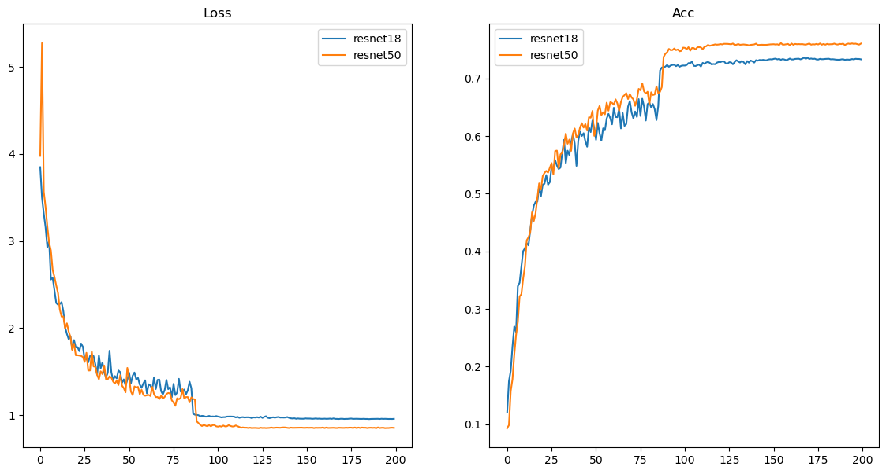

# Graph Knowledge Distillation

## Change log

### Luc

- Remplacement du code de train par une version bcp plus simple avec que ce qui marche.

### Alex

___

## Baseline fully supervised

- **teacher**: resnet50 (23.7M params | top val acc=0.7616). Pour reproduire:
`python train.py --network resnet50`

- **student**: resnet18 (11.2M params | top val acc=0.7362). Pour reproduire:
`python train.py --network resnet18`

## train.py args

- `--network` (str): REQUIRED
- `--dataset` (str): default="cifar100"
- `--rootdir` (str): default="/data/Datasets/cifar100/"
- `--output_dir` (str): default="./logs/"
- `--batch_size` (int): default=256
- `--name` (str): default=None

___

## Distance

- pas de problème pour calculer des cosine similarities intra layer
- pas de problème pour utiliser POT mais pas facile d'avoir un truc différentiable; c.f:
    - [Optimizing the Gromov-Wasserstein distance with PyTorch](https://pythonot.github.io/master/auto_examples/backends/plot_optim_gromov_pytorch.html)
    - [Gromov and Fused-Gromov-Wasserstein](https://pythonot.github.io/master/auto_examples/index.html#gromov-and-fused-gromov-wasserstein)